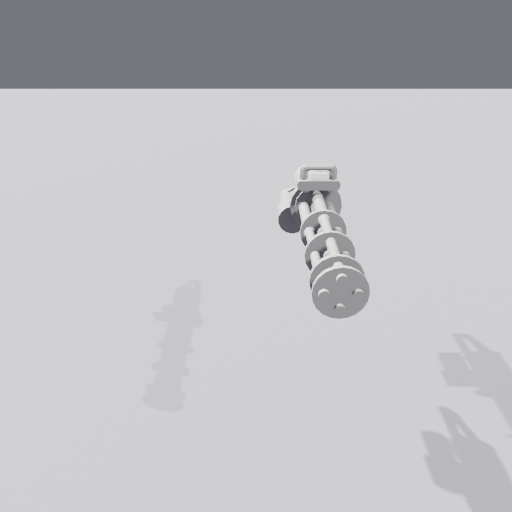
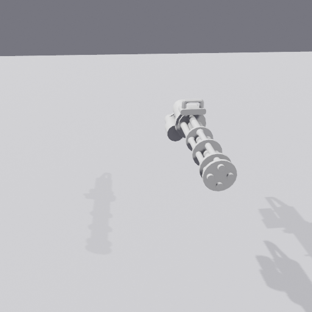
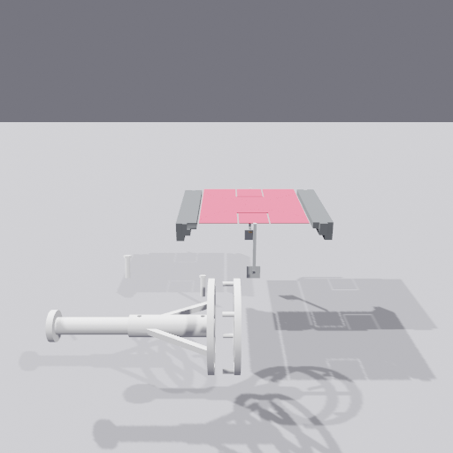
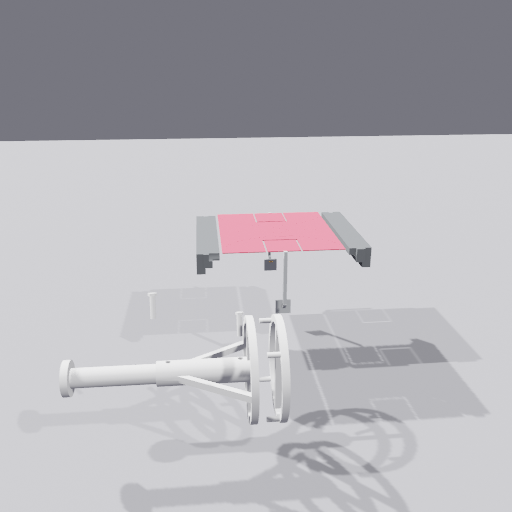
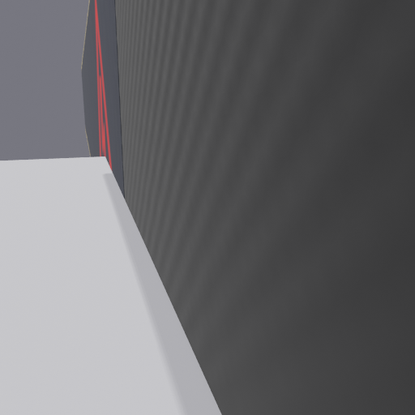
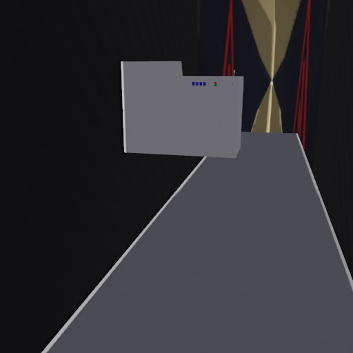
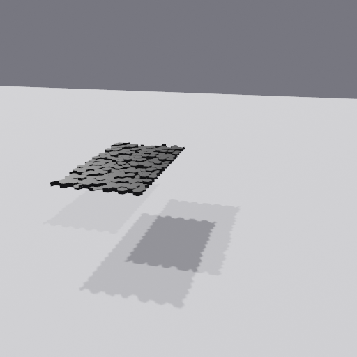
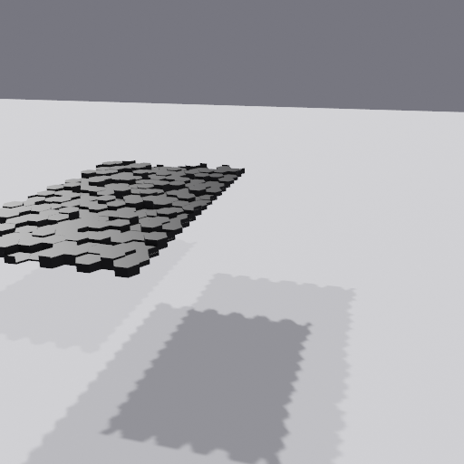

# Objaverse 3D Video Generator

A data generator for 3D video reasoning tasks using [Blender](https://www.blender.org/) and [Objaverse](https://objaverse.allenai.org/). Produces videos of 3D objects with controlled camera motions, designed for evaluating next-frame prediction models.

## 4 Task Types

| Task | Objects | Camera Motion | Tests |
|------|---------|---------------|-------|
| `shape_extrapolation` | 1 | 360-degree orbit | Predict unseen backside angles |
| `occlusion_dynamics` | 2 | 360-degree orbit | Predict occlusion patterns |
| `depth_parallax` | 3 | Lateral pan | Predict depth-dependent parallax motion |
| `zoom_consistency` | 1 | Straight zoom | Predict appearance at closer distance |

## Demos

Each task produces a video with first/last frame + prompt. Demo samples are in [`examples/demos/`](examples/demos/).

| Task | First Frame | Last Frame | Video |
|------|-------------|------------|-------|
| **Shape Extrapolation** |  |  | [ground_truth.mp4](examples/demos/shape_extrapolation/ground_truth.mp4) |
| **Occlusion Dynamics** |  |  | [ground_truth.mp4](examples/demos/occlusion_dynamics/ground_truth.mp4) |
| **Depth Parallax** |  |  | [ground_truth.mp4](examples/demos/depth_parallax/ground_truth.mp4) |
| **Zoom Consistency** |  |  | [ground_truth.mp4](examples/demos/zoom_consistency/ground_truth.mp4) |

## Quick Start

### Step 1: Install Python Dependencies

```bash
# Clone the repository
git clone https://github.com/XinyangHan/objaverse-3d-video-generator.git
cd objaverse-3d-video-generator

# Install Python dependencies
pip install -r requirements.txt
# OR install in editable mode
pip install -e .
```

### Step 2: Install Blender 3.6+

#### macOS (Homebrew)
```bash
brew install --cask blender
```

#### Linux
```bash
wget https://download.blender.org/release/Blender3.6/blender-3.6.0-linux-x64.tar.xz
tar xf blender-3.6.0-linux-x64.tar.xz -C /tmp/
```

#### Verify Installation
```bash
blender --version  # Should show Blender 3.6.0 or higher
```

### Step 3: Fix SSL Certificate (macOS with Python.org Python)

If you installed Python from python.org, you may need to install SSL certificates:

```bash
# Python 3.12
/Applications/Python\ 3.12/Install\ Certificates.command

# Python 3.11
/Applications/Python\ 3.11/Install\ Certificates.command
```

Or double-click `Install Certificates.command` in the Python folder in Applications.

### Step 4: Generate Samples

```bash
# Generate 10 samples (first run will download 3D objects, ~5GB, may take hours)
python examples/generate.py --task shape_extrapolation --num-samples 10

# Generate all task types
python examples/generate.py --task all --num-samples 40  # 10 per task
```

**⚠️ First Run Note**: The first execution will download 4,867 3D models from Objaverse (~5GB). This is a one-time download and will be cached in `~/.objaverse/`. Subsequent runs will use the cached files.

## Output Format

Each sample is saved to `data/questions/{task}_task/{task_id}/`:

```
shape_extrapolation_000000/
├── first_frame.png       # First frame
├── final_frame.png       # Last frame
├── prompt.txt            # Task description
└── ground_truth.mp4      # Full video (1024x1024, 16fps, 4s)
```

## Configuration

| Parameter | Default | Description |
|-----------|---------|-------------|
| `--task` | required | Task type or `all` |
| `--num-samples` | required | Number of videos to generate |
| `--resolution` | 1024 | Video resolution (NxN) |
| `--fps` | 16 | Frames per second |
| `--duration` | 4.0 | Video length in seconds |
| `--workers` | 16 | Parallel Blender processes |
| `--seed` | None | Random seed |
| `--objects` | bundled | Path to custom object list |

## 3D Object Assets

Bundled with 4,867 verified Objaverse UIDs (`assets/good_objects.txt`). On first run, objects are downloaded via the Objaverse API and cached locally (~5GB).

## Requirements

- Python 3.8+
- Blender 3.6+ (headless binary, not a pip package)
